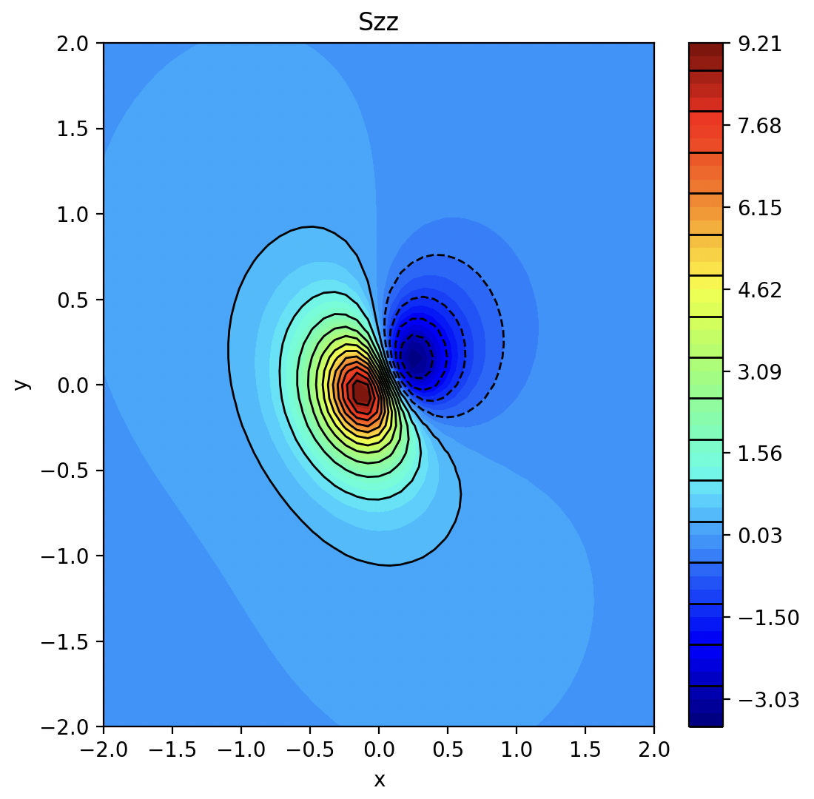

# Initiation to C++ and python binding

<center></center>
<center><i>Display of Szz around a point source</i></center>

## Compilation and testing

### 1) C++

Read the [**README**](./cpp/README.md) file in the `cpp` folder


### 2) Python binding

Read the [**README**](./py/README.md) file in the `py` folder

### 3) Other useful info

- [Packaging](https://pybind11.readthedocs.io/en/stable/compiling.html#modules-with-cmake) with CMake

<br><br><br>

## To look at the dependencies of libs and bins
Go the bin directory

**Macos**
```sh
otool -L pyalgo.so # or app
```

**Linux**
```sh
ldd pyalgo.so # or app
```

**Win**
```sh
dumpbin /dependents pyalgo.dll # or app.exe
```
